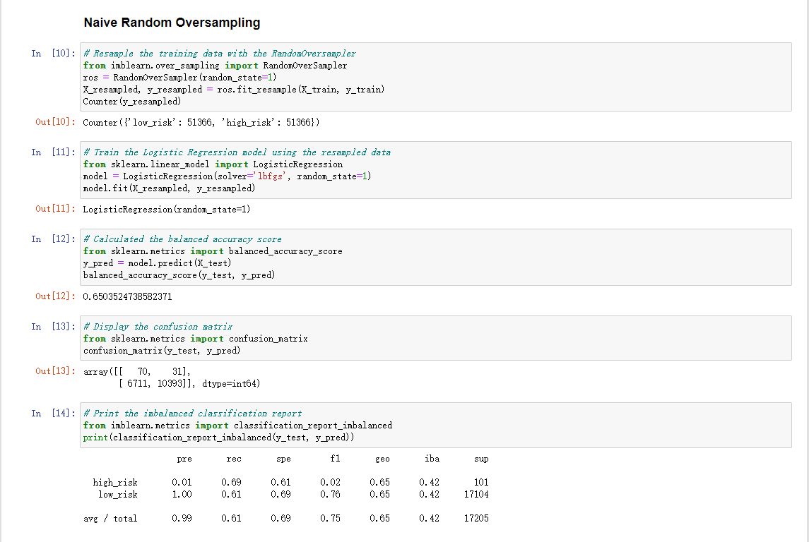
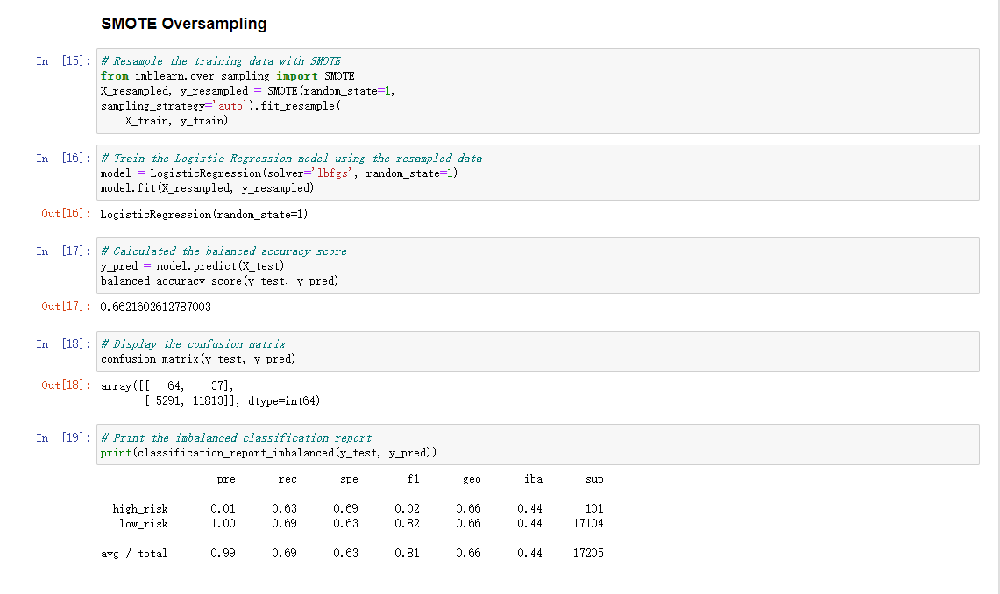

# Credit_Risk_Analysis
## Overview of the Analysis
In order to analyze Credit risk, I used scikit-learn and inbalanced-learn libaries to evaluate models, using resampling to predict credit risk; 
The dataset I used is from LendingClub, by oversampling the data using SMOTE algorithms, undersampling the data using ClusterCentroids algorithm; then using a combined method, using SMOTEENN algorithm to over and undersampling. And then next, by comparing two models (BalancedRandomForestClassifier and EasyEnsembleClassifier), we can predict the credit risk. 

## Purpose of this analysis
The purpose of this analysis is to see if the six models can provide a credit risk prediction tool, using the provided dataset from LendingClub. 

## Result
Below are the screenshots of the six models: 
- Native Ramdom Oversampling: 

The model reports an accuracy test of 65%, a precision score of 99%, and a recall score of 61%, among them the accuaracy and recall scores are not high enough, not reliable metric. 

- SMOTE Oversampling: 

