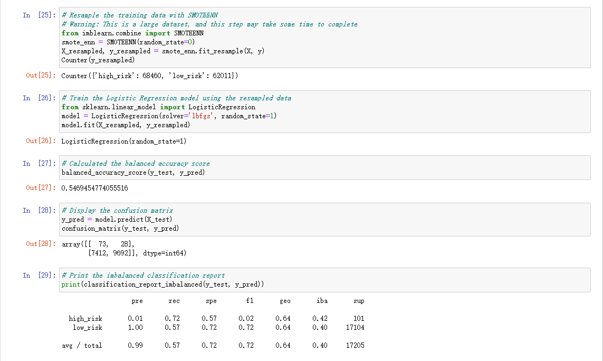

# Credit_Risk_Analysis
## Overview of the Analysis
In order to analyze Credit risk, I used scikit-learn and inbalanced-learn libaries to evaluate models, using resampling to predict credit risk; 
The dataset I used is from LendingClub, by oversampling the data using SMOTE algorithms, undersampling the data using ClusterCentroids algorithm; then using a combined method, using SMOTEENN algorithm to over and undersampling. And then next, by comparing two models (BalancedRandomForestClassifier and EasyEnsembleClassifier), we can predict the credit risk. 

## Purpose of this analysis
The purpose of this analysis is to see if the six models can provide a credit risk prediction tool, using the provided dataset from LendingClub. 

## Result
Below are the screenshots of the six models: 
- Native Ramdom Oversampling: 

The model reports an accuracy test of 65%, a precision score of 99%, and a recall score of 61%, among them the accuaracy and recall scores are not high enough, not reliable metric. 

- SMOTE Oversampling: 

This model reports an accuracy test of 66%, a precision score of 99%, and a recall score of 69%, also not high enough to be reliable metric. 

- ClusterCentroids Undersampling: 

This model reports an accuracy test of 66%, a precision score of 99%, and a recall score of 68%, also not high enough to be reliable metric. 

- SMOTEENN Sampling: 

This model reports an accuracy test of 55%, a precision score of 99%, and a recall score of 72%, also not high enough to be reliable metric. 

- Balanced Random Forest Classifier: 

This model reports an accuracy test of 77%, a precision score of 99%, and a recall score of 87%, not high enough to be reliable metric.

- Easy Ensemble Adaboost Classifier: 

And the sixth model, we have an accuracy test of 93%, a precision score of 99%, and a recall score of 94%, which is much higher than the previous models, but still not strong enough to be reliable metrics for predicting credit risk. 

## Summary
The first 5 models are all showing low accuracy and recall score, first four models are undersampling, oversampling and combination, to predict which loans are at the highest risk,and then the other 2 models are using resampling data using ensemble classifiers to predict which loans are high or low risks. Only the last model (Easy Ensemble) showing a much higher recall score and accuracy test score, but still not high enough (at least 99.5%) to be a reliable metrics. So some improvements are needed. 
